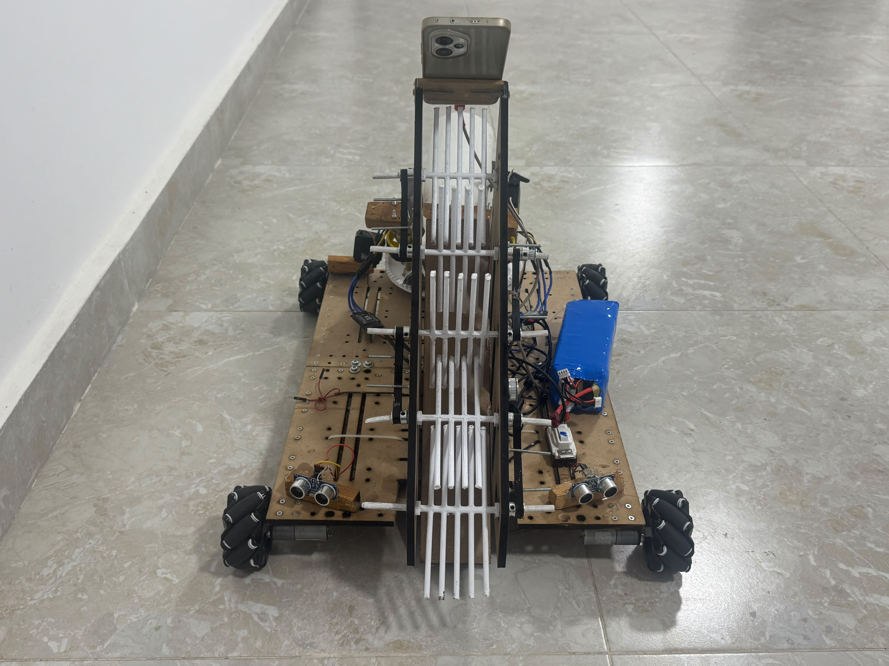
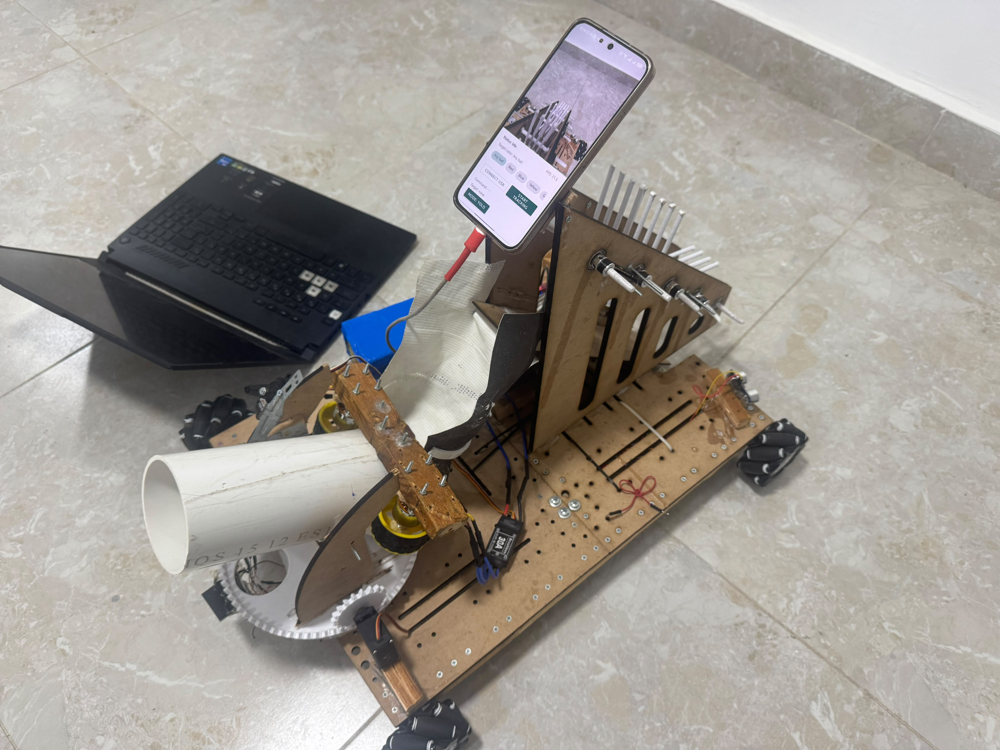
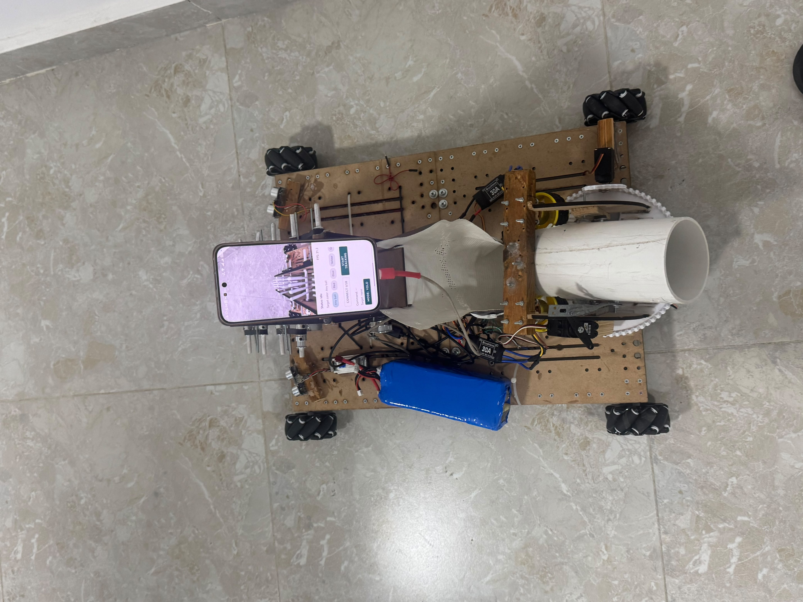
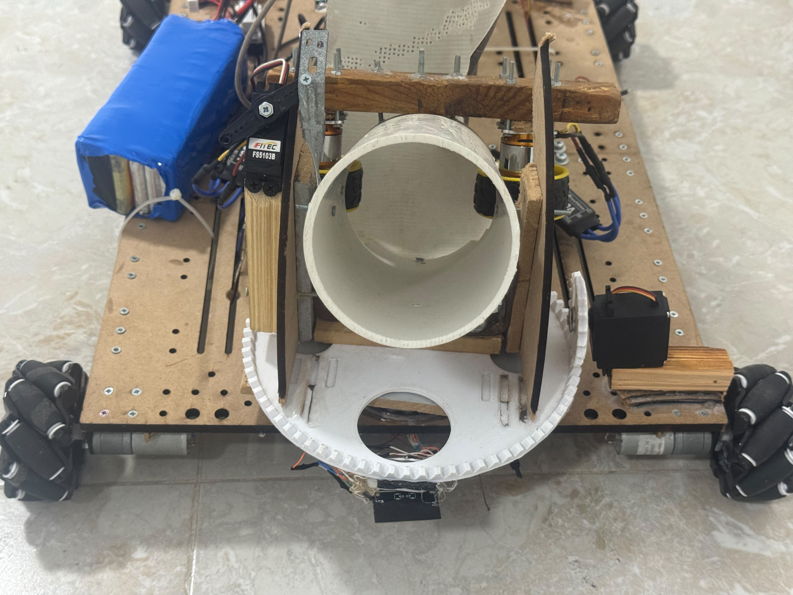
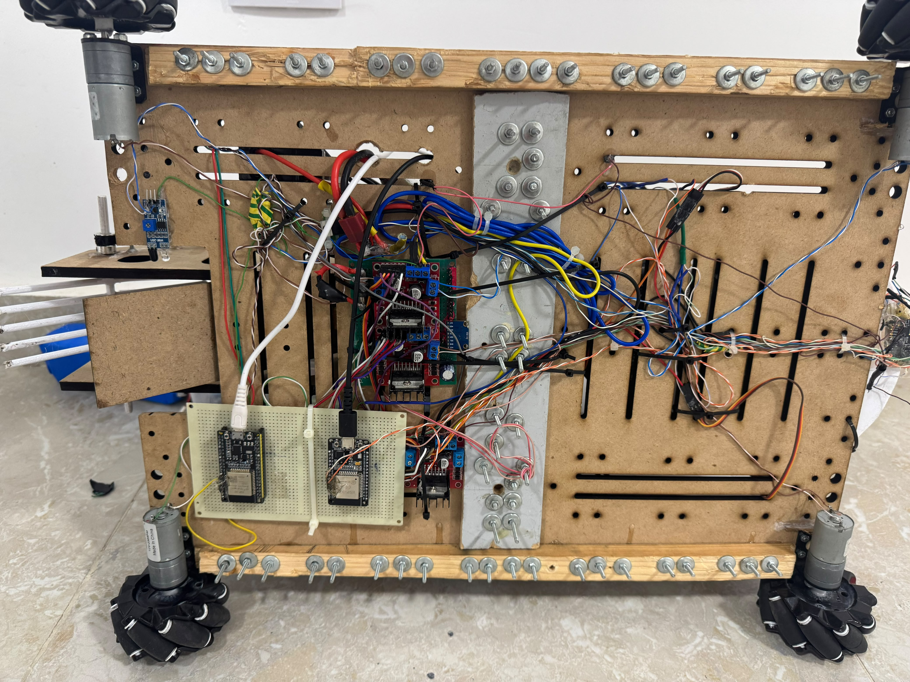
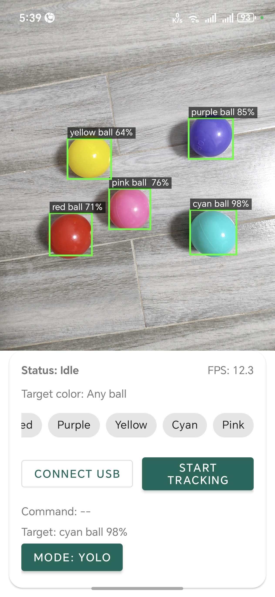
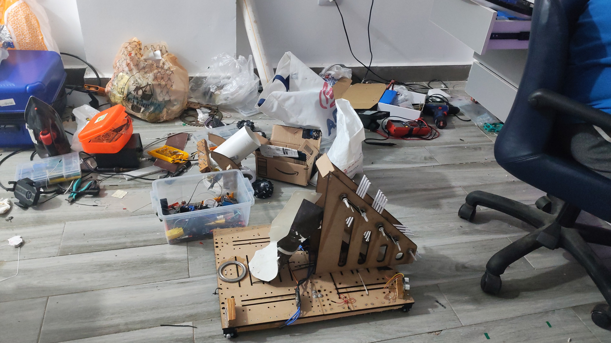
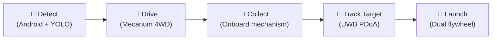
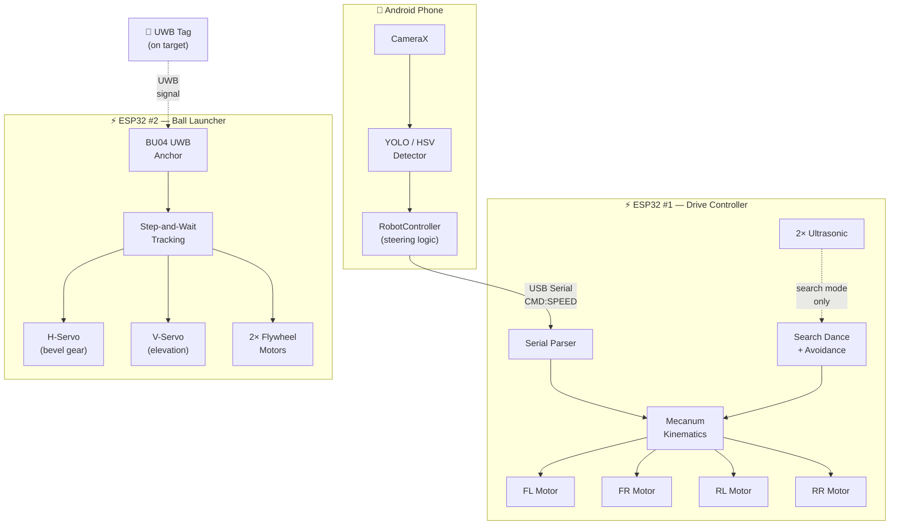

<p align="center">
  <h1 align="center">🤖 Autonomous Ball Collector</h1>
  <p align="center">
    <strong>An autonomous mobile robot that detects, collects, and launches colored balls using computer vision, mecanum omnidirectional drive, and UWB-tracked aiming.</strong>
  </p>
  <p align="center">
    
    
    
    
    
  </p>
</p>

---

## 📸 Demo

<p align="center">
  
</p>

<p align="center">
  <em>Front view — ball guide ramps, phone camera mount, ultrasonic sensors at front corners</em>
</p>

<table>
  <tr>
    <td align="center"><br><em>Side view — full assembly</em></td>
    <td align="center"><br><em>Top view — app running</em></td>
  </tr>
  <tr>
    <td align="center"><br><em>Launcher — barrel, servos, bevel gear</em></td>
    <td align="center"><br><em>Electronics — ESP32s, L298N drivers</em></td>
  </tr>
</table>

### 📱 Android App

<table>
  <tr>
    <td align="center"></td>
    <td align="center"></td>
    <td align="center"></td>
  </tr>
</table>

### 🔧 Build Environment

<p align="center">
  
</p>

<p align="center"><em>The workshop where it all came together</em></p>

---

## 🎯 What It Does

The robot operates in a fully autonomous pipeline:



1. **Detect** — An Android phone running YOLOv8 detects colored balls in real time
2. **Drive** — Commands sent over USB serial drive 4 mecanum wheels toward the ball
3. **Collect** — The ball is captured by the onboard collecting mechanism
4. **Track** — A UWB module locates the target box using phase-difference-of-arrival
5. **Launch** — A dual-flywheel launcher fires the ball with distance-adaptive speed and ballistic gravity compensation

---

## ✨ Key Features

| Feature | Description |
|---------|------------|
| 🔍 **Dual Detection Modes** | YOLOv8n INT8 TFLite (NNAPI/GPU accelerated) + HSV color fallback. Detects 6 ball colors. |
| 🛞 **Mecanum Omnidirectional Drive** | 10 motion types: forward, backward, strafe, diagonal, rotation. **Pure lateral slides** for fine ball centering. |
| 🔊 **Ultrasonic Obstacle Avoidance** | 2× HC-SR04 at front corners. Active during search, bypassed during tracking. |
| 📡 **UWB Target Tracking** | BU04 G451 PDoA anchor with custom **step-and-wait** algorithm that solves the UWB-on-launcher feedback oscillation problem. |
| 🚀 **Automated Ball Launching** | Dual-flywheel launcher with distance-adaptive motor speed + ballistic gravity compensation. |
| 📱 **Phone-to-ESP32 Serial** | USB-OTG at 115200 baud with command throttling and heartbeat deduplication. |
| 🎚️ **Adaptive Speed Control** | Drive speed ramps down as the ball gets closer. Launch speed scales with target distance. |

---

## 🏗️ System Architecture



---

## 📁 Repository Structure

```
autonomous-ball-collector/
├── README.md
├── LICENSE
├── .gitignore
│
├── docs/
│   ├── detailed_technical_document.md   # Comprehensive technical documentation
│   ├── linkedin_post.md                 # LinkedIn announcement post
│   └── media/                           # Project photos and videos
│
├── ballbot-android/                 # 📱 Android app — vision + driving commands
│   ├── app/src/main/java/com/kareem/ballbot/
│   │   ├── control/                 #   RobotController, RobotCommand, TargetColor
│   │   ├── detect/                  #   YOLO26Detector, HsvBallDetector, FramePreprocessor
│   │   ├── serial/                  #   UsbSerialManager (USB-OTG)
│   │   └── ui/                      #   MainActivity, OverlayView
│   └── app/src/main/assets/         #   best_int8.tflite, labels.txt
│
├── ballbot-esp32/                   # ⚡ ESP32 #1 — Mecanum drive controller
│   ├── platformio.ini
│   └── src/main.cpp
│
└── ball_launcher_esp32/             # 🚀 ESP32 #2 — UWB-tracked ball launcher
    ├── platformio.ini
    ├── include/                     #   config.h, servo_controller.h, etc.
    └── src/                         #   main.cpp, tracking.cpp, uwb_manager.cpp, etc.
```

---

## ⚙️ Hardware

### Drive Platform (ESP32 #1)

| Component | Detail |
|-----------|--------|
| MCU | ESP32 DevKit V1 (30-pin) |
| Motor Drivers | 2× L298N (left side + right side) |
| Wheels | 4× Mecanum 45° (standard X-config) |
| Sensors | 2× HC-SR04 ultrasonic (front corners) |
| Camera | Android phone (mounted on robot) |
| Communication | USB-OTG cable (phone → ESP32) |

### Launcher System (ESP32 #2)

| Component | Detail |
|-----------|--------|
| MCU | ESP32 DevKitC (38-pin) |
| UWB Module | BU04 G451 (dual-antenna PDoA) |
| H-Servo | MG996R via 4:1 bevel gear |
| V-Servo | FT5325M (95°–140° range) |
| Launch Motors | 2× Brushless + ESCs (dual flywheel) |
| Input | Launch button (GPIO 14) |

---

## 🔧 Technologies

| Layer | Technologies |
|-------|-------------|
| **Vision** | Kotlin, CameraX 1.4, TensorFlow Lite (LiteRT) 1.0, YOLOv8n INT8 |
| **Drive Controller** | C++, PlatformIO, Arduino Framework, LEDC PWM |
| **Launcher** | C++, PlatformIO, UWB (BU04 PDoA), Servo PWM, ESC control |
| **Communication** | USB Serial 115200 baud, UART (UWB data + AT commands) |

---

## 🚀 Getting Started

### Prerequisites

- **Android Studio** (for the phone app)
- **PlatformIO** (VS Code extension, for both ESP32 projects)
- **Android phone** with USB-OTG support (API 28+)

### 1. Build the Android App

```bash
cd ballbot-android
./gradlew assembleDebug
# Install APK on phone via adb or Android Studio
```

### 2. Build & Flash the Drive Controller (ESP32 #1)

```bash
cd ballbot-esp32
pio run --target upload
pio device monitor          # 115200 baud
```

### 3. Build & Flash the Ball Launcher (ESP32 #2)

```bash
cd ball_launcher_esp32
pio run --target upload
pio device monitor          # 115200 baud, type HELP for commands
```

### 4. Connect & Run

1. Mount the phone on the robot, connect USB-OTG cable to ESP32 #1
2. Open BallBot app → tap **Connect USB** → tap **Start Tracking**
3. Place UWB tag on the target box
4. Power on ESP32 #2 → type `TRACK` in serial monitor to start UWB tracking
5. Press launch button or type `LAUNCH` to fire

---

## 🎛️ Configuration

### Steering Tuning (Android App)

Found in `MainActivity.kt`:

```kotlin
private val robotController = RobotController(
    horizontalBias    = 0.00f,   // Phone offset: +right / −left
    verticalBias      = 0.00f,   // Phone offset: +down  / −up
    stopAreaThreshold = 0.18f    // Ball area to stop (lower = stop farther)
)
```

### Drive Controller (ESP32 #1)

Found at the top of `src/main.cpp`:

| Parameter | Default | Description |
|-----------|---------|-------------|
| `OBSTACLE_DIST_CM` | 10.0 | Ultrasonic avoidance threshold (cm) |
| `SEARCH_SPEED` | 170 | Dance move PWM (0–255) |
| `CMD_TIMEOUT_MS` | 500 | Auto-stop timeout (tracking only) |

### Launcher (ESP32 #2)

All parameters in `include/config.h`:

| Parameter | Default | Description |
|-----------|---------|-------------|
| `TRACK_STEP_DEG` | 5.0° | Servo step size per tracking iteration |
| `TRACKING_DEADZONE_H` | 8.0° | On-target threshold |
| `GRAVITY_COMP_FACTOR` | 3.0 | Loft degrees per m² of distance |
| `AUTO_SPEED_MIN/MAX` | 5–10% | Motor speed range by distance |

---

## 📜 Communication Protocol

```
Android Phone  ──USB Serial──►  ESP32 #1 (Drive)
                                    │
Format: "CMD:SPEED\n"              │
                                    ▼
┌──────┬───────────────────────────────────┐
│ CMD  │ Action                            │
├──────┼───────────────────────────────────┤
│ F    │ Forward at speed (0–255)          │
│ L    │ Rotate left (counter-clockwise)   │
│ R    │ Rotate right (clockwise)          │
│ SL   │ Strafe left (pure lateral slide)  │
│ SR   │ Strafe right (pure lateral slide) │
│ S    │ Stop all motors                   │
│ X    │ Enter search/dance mode           │
└──────┴───────────────────────────────────┘
```

---

## 🧠 Notable Algorithms

### Step-and-Wait UWB Tracking

The UWB module is mounted **on the rotating launcher**. Traditional PID control causes violent oscillation because servo movement directly changes the UWB angle reading. The custom **step-and-wait** algorithm breaks this feedback loop:

1. Collect angle samples for 250ms
2. If off-target (>8°), make one 5° servo step
3. Discard readings for 80ms (servo still moving)
4. Collect new samples, re-evaluate
5. Repeat until locked on target

### Mecanum Search Dance

When no ball is detected, the robot performs an 18-step dance routine showcasing all mecanum capabilities (spins, strafes, diagonals, zigzags) while ultrasonic sensors prevent collisions.

---

## 📖 Documentation

For full technical details, see [**Detailed Technical Document**](docs/detailed_technical_document.md) — covers every subsystem, algorithm, pin assignment, and design decision in depth.

---


## 👥 Team

**Kareem Shaban Eid** — Mechatronics Engineering Student, E-JUST  
[LinkedIn](https://linkedin.com/in/kareem-04-soliman) · [GitHub](https://github.com/Kareem-04)  

**Mahmoud Alaa** — Mechatronics Engineering Student, E-JUST  
**Mariam Nasr** — Mechatronics Engineering Student, E-JUST  
**Al zahraa Khattab** — Mechatronics Engineering Student, E-JUST  
**Aisha Mostafa** — Mechatronics Engineering Student, E-JUST  
**Malak Ashraf** — Mechatronics Engineering Student, E-JUST  

*Supervised by Prof. Mohamed Alkalla*
