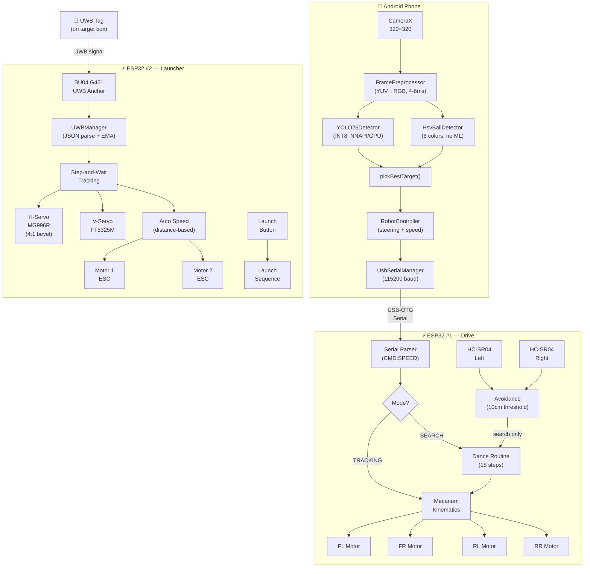
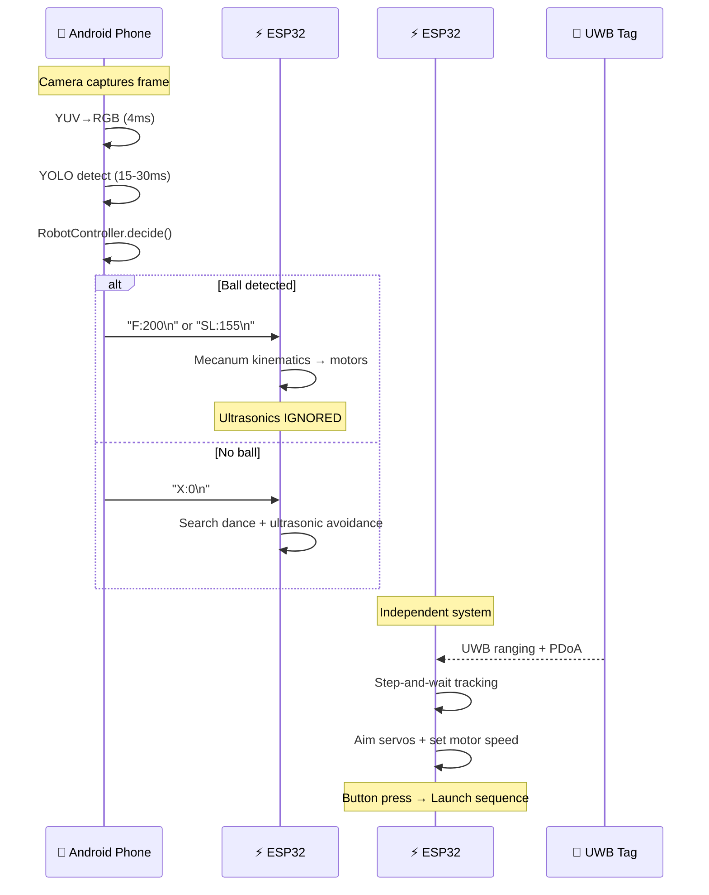
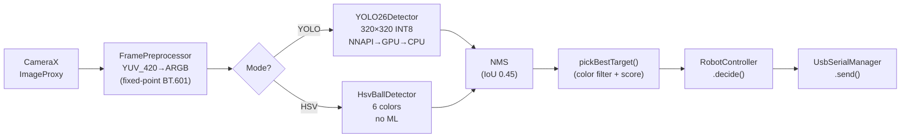
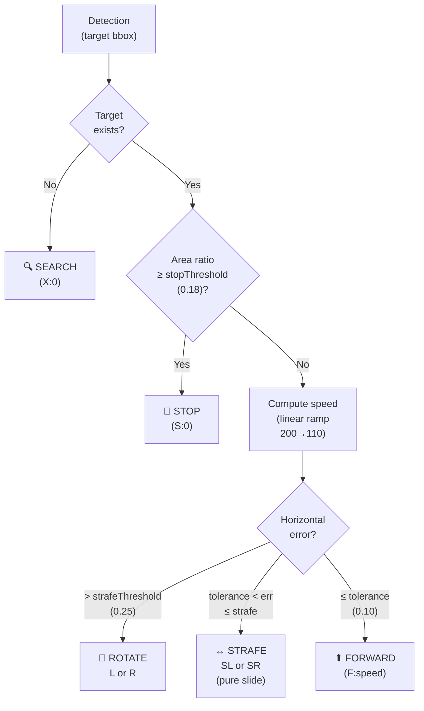
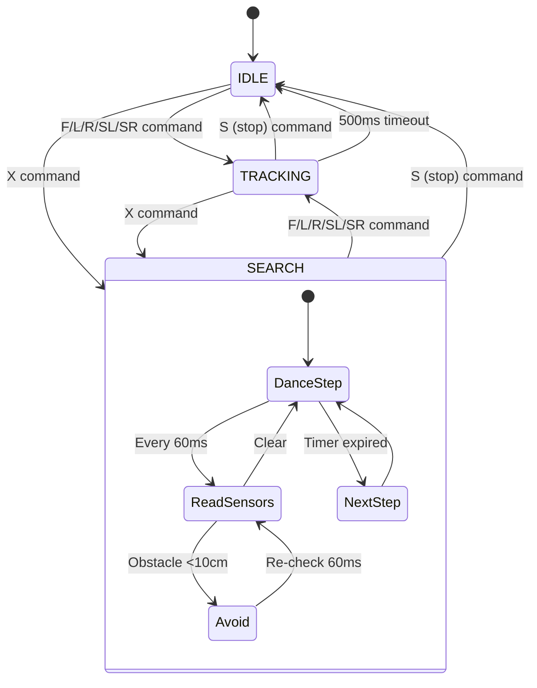
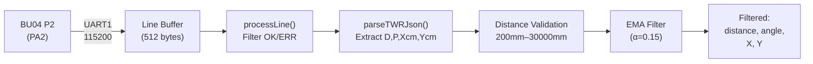
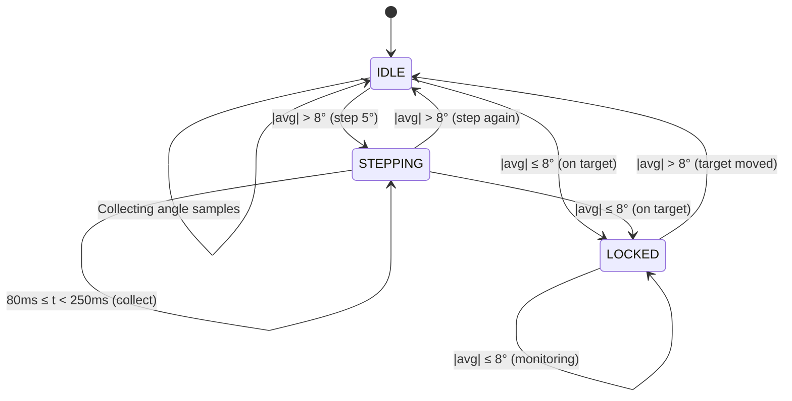
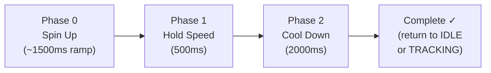
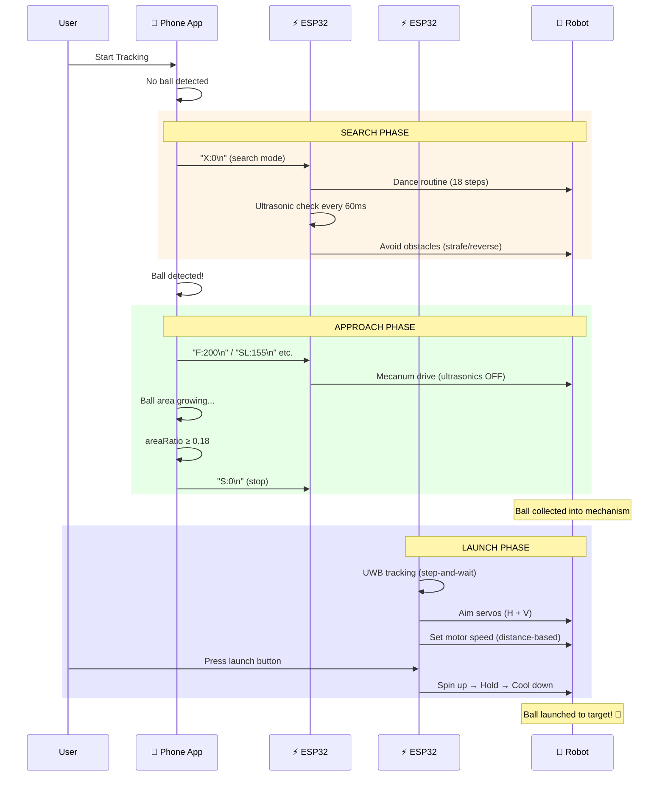

# Autonomous Ball Collector — Comprehensive Technical Documentation

> **Project Type**: University Course Project  
> **Platform**: Android + 2× ESP32 (PlatformIO)  
> **Version**: 1.0 — July 2026  

---

## Table of Contents

1. [System Overview](#1-system-overview)
2. [Overall Architecture](#2-overall-architecture)
3. [Subsystem 1 — Android Vision App](#3-subsystem-1--android-vision-app)
4. [Subsystem 2 — ESP32 Mecanum Drive Controller](#4-subsystem-2--esp32-mecanum-drive-controller)
5. [Subsystem 3 — ESP32 UWB-Tracked Ball Launcher](#5-subsystem-3--esp32-uwb-tracked-ball-launcher)
6. [End-to-End Operational Flow](#6-end-to-end-operational-flow)
7. [Communication Protocols](#7-communication-protocols)
8. [Configuration Reference](#8-configuration-reference)
9. [Build & Deployment](#9-build--deployment)
10. [Design Decisions & Trade-offs](#10-design-decisions--trade-offs)
11. [Known Limitations](#11-known-limitations)

---

## 1. System Overview

The Autonomous Ball Collector is a mobile robot that performs a complete autonomous cycle:

1. **Search** — Explore the environment using mecanum-wheel dance patterns with ultrasonic obstacle avoidance
2. **Detect** — Identify colored balls in real time using YOLOv8 or HSV color detection on an Android phone
3. **Approach** — Drive toward the detected ball using adaptive speed control and lateral sliding for fine alignment
4. **Collect** — Capture the ball into the onboard collecting mechanism
5. **Aim** — Track the target box using UWB positioning with a custom step-and-wait algorithm
6. **Launch** — Fire the ball using a dual-flywheel launcher with distance-adaptive speed and ballistic gravity compensation

### Three Processing Units

| Unit | Hardware | Role |
|------|----------|------|
| Android Phone | Honor 400 (arm64-v8a) | Ball detection (YOLO/HSV) + steering decisions |
| ESP32 #1 | DevKit V1 (30-pin) | Motor control, mecanum kinematics, ultrasonic avoidance |
| ESP32 #2 | DevKitC (38-pin) | UWB tracking, servo aiming, flywheel motor control |

---

## 2. Overall Architecture

### 2.1 System Block Diagram



### 2.2 Data Flow Summary



---

## 3. Subsystem 1 — Android Vision App

### 3.1 Package Structure

```
com.kareem.ballbot/
├── control/
│   ├── RobotController.kt       — Steering and speed decision engine
│   ├── RobotCommand.kt          — Sealed class: wire protocol commands
│   └── TargetColor.kt           — Color filter enum (ANY, RED, BLUE, YELLOW, GREEN)
├── detect/
│   ├── Detection.kt             — Data class: label, score, boundingBox
│   ├── DetectorConfig.kt        — Model config: inputSize=320, threshold=0.30
│   ├── FramePreprocessor.kt     — YUV→RGB fixed-point conversion
│   ├── YOLO26Detector.kt        — YOLOv8 TFLite inference
│   └── HsvBallDetector.kt       — HSV color-based detector (no ML)
├── serial/
│   └── UsbSerialManager.kt      — USB-OTG serial driver
└── ui/
    ├── MainActivity.kt           — Camera loop, detection dispatch, UI
    └── OverlayView.kt            — Bounding box visualization overlay
```

### 3.2 Detection Pipeline



#### 3.2.1 Frame Preprocessing — `FramePreprocessor.kt`

The original implementation used: YUV → NV21 → JPEG encode (quality 90) → JPEG decode → Bitmap. This cost 20–40ms per frame.

The optimized version does: YUV_420_888 planes → ARGB int array → Bitmap using fixed-point BT.601 coefficients (×1024), costing only 4–6ms — a **5–8× improvement**.

Key optimizations:
- **Buffer reuse**: `argbCache` IntArray is allocated once and reused across frames
- **Fixed-point arithmetic**: Integer multiply + shift instead of float division
- **No intermediate JPEG**: Eliminates encode/decode entirely

```
y = (Y - 16) × 1192          // fixed-point luminance
u = U - 128                   // chroma offset
v = V - 128
r = (y + 1634v) >> 10         // BT.601 red
g = (y - 833v - 400u) >> 10   // BT.601 green
b = (y + 2066u) >> 10         // BT.601 blue
```

#### 3.2.2 YOLO Detector — `YOLO26Detector.kt`

| Parameter | Value |
|-----------|-------|
| Model | `best_int8.tflite` (YOLOv8n, INT8 quantized) |
| Input Size | 320 × 320 |
| Model Size | ~2.7 MB |
| Output Shape | `[1, rows, 6]` — `[x1, y1, x2, y2, confidence, class_id]` |
| Score Threshold | 0.30 |
| NMS IoU Threshold | 0.45 |
| Max Results | 5 |

**Labels** (from `labels.txt`):
| Index | Label |
|-------|-------|
| 0 | black ball |
| 1 | blue ball |
| 2 | green ball |
| 3 | pink ball |
| 4 | red ball |
| 5 | yellow ball |

**Delegate Chain**:
1. **NNAPI** (routes to device NPU on Qualcomm/MediaTek) — tried first, best for INT8
2. **GPU** (OpenGL ES compute) — fallback if NNAPI unavailable
3. **CPU** (4 threads) — final fallback

**Performance Optimizations**:
- All per-frame heap allocations eliminated (input/output buffers pre-allocated in `init`)
- Per-row early-exit on quantized models: checks quantized confidence byte before dequantization, skipping ~97% of background rows
- Reused pixel array across frames eliminates GC pressure

#### 3.2.3 HSV Ball Detector — `HsvBallDetector.kt`

A lightweight, ML-free alternative that classifies pixels by HSV color ranges:

| Color | Hue (°) | Saturation | Brightness |
|-------|---------|-----------|------------|
| Red | <18 or ≥345 | >0.55 | >0.30 |
| Blue | 190–265 | >0.38 | — |
| Yellow | 28–68 | >0.38 | >0.50 |
| Green | 80–165 | >0.38 | — |
| Pink | 300–345 | 0.18–0.75 | >0.55 |
| Purple | 265–305 | >0.30 | >0.20 |

- Downsamples by stride=3 for speed
- Computes bounding box from classified pixel extremes
- Density-based confidence score: `score = min(density × 1.5, 1.0)`
- Minimum pixel fraction threshold: 0.3% of sampled pixels

### 3.3 Steering Algorithm — `RobotController.kt`



**Input calculations**:
```
centerX         = (bbox.left + bbox.right) / 2
normalizedError = (centerX / frameWidth) - (0.5 + horizontalBias)
areaRatio       = (bbox.width × bbox.height) / (frameWidth × frameHeight)
```

**Speed ramp** (linear interpolation):
```
if areaRatio ≤ farAreaThreshold (0.04):
    speed = farSpeed (200)
else:
    t = (areaRatio - farThreshold) / (stopThreshold - farThreshold)
    speed = farSpeed + t × (nearSpeed - farSpeed)    // 200 → 110
```

**Tunable parameters**:

| Parameter | Default | Description |
|-----------|---------|-------------|
| `horizontalBias` | 0.00 | Phone holder offset: +right / −left |
| `verticalBias` | 0.00 | Phone holder offset: +down / −up (reserved) |
| `centerTolerance` | 0.10 | Dead zone — no steering |
| `strafeThreshold` | 0.25 | Rotate vs. strafe boundary |
| `stopAreaThreshold` | 0.18 | Ball area ratio to stop (lower = stop farther) |
| `farAreaThreshold` | 0.04 | Area ratio for full speed |
| `farSpeed` | 200 | PWM at maximum distance |
| `nearSpeed` | 110 | PWM when close |

### 3.4 Wire Protocol — `RobotCommand.kt`

```
Format: "CMD:SPEED\n"

┌─────────┬──────────────────────────────────────┐
│ Command │ Wire Value Example                   │
├─────────┼──────────────────────────────────────┤
│ Forward │ "F:200\n"                            │
│ Left    │ "L:150\n"   (rotate CCW)             │
│ Right   │ "R:150\n"   (rotate CW)              │
│ Strafe L│ "SL:155\n"  (pure lateral slide)     │
│ Strafe R│ "SR:155\n"  (pure lateral slide)     │
│ Stop    │ "S:0\n"                              │
│ Search  │ "X:0\n"     (enter search mode)      │
└─────────┴──────────────────────────────────────┘
```

### 3.5 Command Throttling

Commands are sent to the ESP32 with deduplication:
- **Changed command**: sent immediately
- **Same command**: sent only if 80ms heartbeat has elapsed
- **Explicit stop**: always sent unconditionally (bypasses dedup)

This prevents flooding the USB buffer (~12 commands/sec at 80ms heartbeat) while ensuring the ESP32 doesn't lose state.

### 3.6 UI Features

- **Live camera preview** with bounding box overlay (FILL_CENTER aspect-ratio correction)
- **FPS counter** (1-second sliding window)
- **Color filter chips**: Any, Red, Blue, Yellow, Green, Pink, Purple
- **Mode toggle**: YOLO ↔ HSV
- **Keep screen on**: `FLAG_KEEP_SCREEN_ON` prevents screen dimming during operation
- **USB status**: Connection state and last sent command displayed

### 3.7 Dependencies

| Library | Version | Purpose |
|---------|---------|---------|
| CameraX | 1.4.2 | Camera preview + image analysis |
| LiteRT (TFLite) | 1.0.1 | ML inference (NNAPI/GPU/CPU) |
| LiteRT GPU | 1.0.1 | GPU delegate for TFLite |
| LiteRT Support | 1.0.1 | Model loading utilities |
| usb-serial-for-android | 3.9.0 | USB-OTG serial communication |
| Kotlin Coroutines | 1.9.0 | Async operations |
| Material Components | 1.12.0 | UI components (chips, cards, buttons) |

---

## 4. Subsystem 2 — ESP32 Mecanum Drive Controller

### 4.1 Hardware Components

| Component | Specification |
|-----------|---------------|
| MCU | ESP32 DevKit V1 (30-pin), 240 MHz dual-core |
| Motor Drivers | 2× L298N (Left: FL+RL, Right: FR+RR) |
| Wheels | 4× Mecanum 45° (standard X-configuration) |
| Ultrasonic | 2× HC-SR04 (left front + right front corners) |
| PWM | 4 LEDC channels, 1 kHz, 8-bit resolution |

### 4.2 Pin Assignment

```
Left L298N — Front-Left (FL) + Rear-Left (RL)
┌──────────────┬────────────┐
│ L298N Pin    │ ESP32 GPIO │
├──────────────┼────────────┤
│ ENA (FL spd) │ GPIO 23    │
│ IN1 (FL dir) │ GPIO 27    │
│ IN2 (FL dir) │ GPIO 26    │
│ ENB (RL spd) │ GPIO 14    │
│ IN3 (RL dir) │ GPIO 25    │
│ IN4 (RL dir) │ GPIO 33    │
└──────────────┴────────────┘

Right L298N — Front-Right (FR) + Rear-Right (RR)
┌──────────────┬────────────┐
│ L298N Pin    │ ESP32 GPIO │
├──────────────┼────────────┤
│ ENA (FR spd) │ GPIO 12    │
│ IN1 (FR dir) │ GPIO 13    │
│ IN2 (FR dir) │ GPIO 15    │
│ ENB (RR spd) │ GPIO 2     │
│ IN3 (RR dir) │ GPIO 0     │
│ IN4 (RR dir) │ GPIO 4     │
└──────────────┴────────────┘

Ultrasonic Sensors (HC-SR04)
┌──────────────────┬──────┬──────┐
│ Sensor           │ TRIG │ ECHO │
├──────────────────┼──────┼──────┤
│ Left Front       │ G5   │ G18  │
│ Right Front      │ G19  │ G21  │
└──────────────────┴──────┴──────┘

IR Sensor: GPIO 22 (reserved, not used)
```

> [!NOTE]
> GPIO 0 and GPIO 2 are ESP32 strapping pins. GPIO 0 controls boot mode (must be HIGH for normal boot). GPIO 15 controls SDIO debug output. These work correctly when configured as outputs after boot, but may cause issues if the L298N pulls them during power-on.

### 4.3 Operating Modes



| Mode | Trigger | Ultrasonics | Behavior |
|------|---------|-------------|----------|
| IDLE | `S` command or timeout | Off | All motors stopped |
| TRACKING | `F/L/R/SL/SR` command | **Ignored** | Executes phone's commands directly |
| SEARCH | `X` command | **Active** (60ms polling) | Dance routine + collision avoidance |

### 4.4 Mecanum Inverse Kinematics

For standard X-configuration mecanum wheels:

```
Wheel layout (top view):       Roller orientation:
   FL ──── FR                    FL: ╲     FR: ╱
   │  ROBOT │                    RL: ╱     RR: ╲
   RL ──── RR

Equations:
   FL = Vy + Vx + ω        FR = Vy − Vx − ω
   RL = Vy − Vx + ω        RR = Vy + Vx − ω

Where: Vy = forward(+),  Vx = strafe right(+),  ω = spin CW(+)
```

**Complete motion table** (10 motion types):

| Motion | Vy | Vx | ω | FL | FR | RL | RR |
|--------|----|----|---|----|----|----|----|
| Forward | + | 0 | 0 | ↑ | ↑ | ↑ | ↑ |
| Backward | − | 0 | 0 | ↓ | ↓ | ↓ | ↓ |
| Strafe Left | 0 | − | 0 | ↓ | ↑ | ↑ | ↓ |
| Strafe Right | 0 | + | 0 | ↑ | ↓ | ↓ | ↑ |
| Rotate CW | 0 | 0 | + | ↑ | ↓ | ↑ | ↓ |
| Rotate CCW | 0 | 0 | − | ↓ | ↑ | ↓ | ↑ |
| Diag Fwd-Left | + | − | 0 | 0 | ↑ | ↑ | 0 |
| Diag Fwd-Right | + | + | 0 | ↑ | 0 | 0 | ↑ |
| Diag Back-Left | − | − | 0 | ↓ | 0 | 0 | ↓ |
| Diag Back-Right | − | + | 0 | 0 | ↓ | ↓ | 0 |

> [!IMPORTANT]
> **Strafe commands (SL/SR) produce pure lateral slides with zero rotation.** This is critical for fine ball alignment — when the ball is near the camera center, rotating would lose the ball from view, but sliding keeps it centered.

### 4.5 Search Dance Routine

When no ball is detected, the phone sends `X:0` and the robot performs an 18-step dance showcasing all mecanum capabilities:

| Step | Motion | Duration | Purpose |
|------|--------|----------|---------|
| 1 | Spin CW | 800ms | Scan right |
| 2 | Strafe Right | 500ms | Slide right |
| 3 | Spin CCW | 800ms | Scan left |
| 4 | Strafe Left | 500ms | Slide left |
| 5 | Diag Fwd-Right | 500ms | ↗ Diamond pattern |
| 6 | Diag Fwd-Left | 500ms | ↖ |
| 7 | Diag Back-Left | 500ms | ↙ |
| 8 | Diag Back-Right | 500ms | ↘ |
| 9 | Forward | 500ms | Zigzag advance |
| 10 | Spin CW | 400ms | Quick turn |
| 11 | Forward | 500ms | Continue advance |
| 12 | Spin CCW | 400ms | Quick turn back |
| 13 | Strafe Left | 700ms | Lateral sweep |
| 14 | Forward | 300ms | Step forward |
| 15 | Strafe Right | 700ms | Sweep back |
| 16 | Forward | 300ms | Step forward |
| 17 | Backward | 400ms | Retreat |
| 18 | Spin CW | 1200ms | Full 360° scan |

The sequence loops until a tracking command interrupts it.

### 4.6 Ultrasonic Collision Avoidance

- **Sensor polling**: Every 60ms during search mode
- **Measurement**: `pulseIn()` with 6000µs timeout (~1m max range)
- **Distance formula**: `distance_cm = duration × 0.01715`

**Avoidance logic**:

| Condition | Action |
|-----------|--------|
| Left < 10cm AND Right < 10cm | Reverse at 200 PWM |
| Left < 10cm only | Strafe right at 200 PWM |
| Right < 10cm only | Strafe left at 200 PWM |
| Both clear | Resume dance step |

The avoidance overrides the current dance step. When the obstacle clears, the interrupted dance step resumes from the beginning.

> [!IMPORTANT]
> Ultrasonics are **completely disabled** during tracking mode. When the phone is guiding the robot toward a ball, obstacle avoidance would interfere with the approach.

### 4.7 Safety Features

- **Command timeout**: If no serial command received for 500ms in tracking mode, auto-stop. Prevents runaway if USB disconnects.
- **Search mode exempt**: Search mode runs indefinitely until interrupted — it self-manages via the dance loop.
- **LEDC compatibility**: `#if` compile-time guards support both ESP32 Arduino Core 2.x (channel-based API) and 3.x (pin-based API).

### 4.8 Build Metrics

```
RAM:   [=         ]   6.6% (21,600 / 327,680 bytes)
Flash: [==        ]  21.3% (279,793 / 1,310,720 bytes)
Build time: ~2.5 seconds
```

---

## 5. Subsystem 3 — ESP32 UWB-Tracked Ball Launcher

### 5.1 Hardware Components

| Component | Specification |
|-----------|---------------|
| MCU | ESP32 DevKitC (38-pin), 240 MHz dual-core |
| UWB Module | BU04 G451 (dual-antenna PDoA, STM32G4 + DW3000) |
| H-Servo | MG996R, 500–2500µs, via 4:1 bevel gear (inverted) |
| V-Servo | FT5325M, 1280–1600µs, 95°–140° range |
| Launch Motors | 2× Brushless + ESC, 1000–2000µs standard RC |
| Input | Launch button GPIO 14 (active LOW, internal pull-up) |
| Indicator | Status LED GPIO 2 |

### 5.2 Pin Assignment

```
GPIO  2  → Status LED (built-in)
GPIO 14  → Launch button (active LOW)
GPIO 16  → UWB AT command RX (Serial2 RX)
GPIO 17  → UWB AT command TX (Serial2 TX)
GPIO 18  → UWB data stream RX (UART1 RX, from BU04 P2)
GPIO 25  → Motor 1 ESC signal
GPIO 26  → Motor 2 ESC signal
GPIO 32  → Vertical servo (FT5325M)
GPIO 33  → Horizontal servo (MG996R)
```

> [!WARNING]
> The BU04 data stream uses **P2 (PA2)**, NOT the USART1 pins. USART1 is only for AT configuration commands. Connecting data to the wrong port produces no output.

### 5.3 File Structure

```
ball_launcher_esp32/
├── platformio.ini
├── include/
│   ├── config.h               — All tunable parameters (centralized)
│   ├── servo_controller.h     — Servo class definition
│   ├── launcher_motor.h       — Motor/ESC class definition
│   ├── uwb_manager.h          — UWB class + UWBData struct
│   └── tracking.h             — Tracking state machine definition
└── src/
    ├── main.cpp               — Entry point, loop, serial commands (467 lines)
    ├── servo_controller.cpp   — Servo PWM control (138 lines)
    ├── launcher_motor.cpp     — ESC/motor control (101 lines)
    ├── uwb_manager.cpp        — UWB parsing + AT commands (372 lines)
    └── tracking.cpp           — Step-and-wait algorithm (277 lines)
```

### 5.4 UWB Data Pipeline



**Raw JSON from BU04**:
```json
JS006E{"TWR":{"a16":"F482","R":194,"T":902247,"D":135,"P":105,"Xcm":78,"Ycm":105,"O":0,"V":49152}}
```

| Field | Description | Unit |
|-------|-------------|------|
| `D` | Distance to tag | centimeters |
| `P` | PDoA raw phase value | integer |
| `Xcm` | Horizontal offset | centimeters |
| `Ycm` | Forward distance | centimeters |

**Exponential Moving Average Filter**:
```
filtered = α × new_value + (1 - α) × filtered

FILTER_ALPHA_DIST  = 0.15  (heavy smoothing for distance)
FILTER_ALPHA_ANGLE = 0.15  (moderate smoothing)
```

### 5.5 Step-and-Wait Tracking Algorithm

> [!IMPORTANT]
> **The core engineering challenge**: The UWB antenna is mounted ON the launcher. When the servo moves to aim, the antenna rotates too, changing the UWB angle reading. This creates a feedback loop where PID control causes violent oscillation between servo extremes.

#### The Problem

```
1. UWB reads angle = 15° → PID moves servo right
2. Servo rotates → UWB antenna rotates
3. UWB now reads -30° (completely different)
4. PID reacts to -30° → slams servo left
5. Result: Servo oscillates violently between 0° and 180°
```

Additionally, the BU04 PDoA data is inherently noisy — a stationary tag produces readings varying ±30°.

#### The Solution



**Algorithm detail**:

```
1. IDLE — Collect raw angle samples for 250ms (≥5 samples)
   │
   ├── angleSamples += atan2(Xcm, Ycm)
   ├── sampleCount++
   │
   └── After 250ms AND ≥5 samples:
       ├── avgAngle = angleSamples / sampleCount
       ├── |avgAngle| ≤ 8° → LOCKED ✓
       └── |avgAngle| > 8° → Move servo 5°, go to STEPPING

2. STEPPING — Wait for system to settle
   │
   ├── t < 80ms:  Discard all readings (servo still moving)
   ├── 80ms ≤ t < 250ms:  Collect angle samples
   └── t ≥ 250ms:  Evaluate average
       ├── |avgAngle| ≤ 8° → LOCKED
       └── |avgAngle| > 8° → IDLE (will step again)

3. LOCKED — On target, monitoring
   │
   ├── Continue collecting samples every 250ms
   ├── |avgAngle| ≤ 8° → Stay LOCKED
   └── |avgAngle| > 8° → IDLE (target moved)
```

**Bevel gear inversion**: The horizontal servo drives a 4:1 bevel gear. The gear reverses direction, so:
```cpp
if (SERVO_H_INVERTED) {
    if (avgAngle > 0) targetH -= step;  // Target right → decrease servo
    else              targetH += step;  // Target left  → increase servo
}
```
A 5° servo step produces 1.25° of launcher rotation.

**Why it works**:

| Problem | Solution |
|---------|----------|
| Feedback oscillation | Moves only every 250ms — servo physically stops before next reading |
| PDoA noise (±30°) | Averages ~7 samples per window — noise cancels out |
| Overshoot | 5° steps (=1.25° launcher) can't overshoot dramatically |
| Stale readings | First 80ms after each step are discarded |

### 5.6 Vertical Aiming

Computed directly from distance (not feedback-controlled):

```
heightDiff = TARGET_HEIGHT_MM − LAUNCHER_HEIGHT_MM
horizDist  = √(slantDistance² − heightDiff²)
elevDeg    = atan2(heightDiff, horizDist) × 180/π

// Gravity compensation (parabolic trajectory)
gravComp   = GRAVITY_COMP_FACTOR × distance_m²
//   1m → +3° loft
//   2m → +12° loft
//   3m → +27° loft

servoAngle = SERVO_V_CENTER + elevDeg + gravComp
servoAngle = constrain(servoAngle, 95°, 140°)
```

### 5.7 Distance-Adaptive Motor Speed

```
fraction = (distance_m − 0.5) / (5.0 − 0.5)
speed%   = AUTO_SPEED_MIN + fraction × (AUTO_SPEED_MAX − AUTO_SPEED_MIN)
```

| Distance | Motor Speed |
|----------|-------------|
| 0.5m | 5% (minimum) |
| 2.5m | 7.5% |
| 5.0m | 10% (maximum) |

A **3% hysteresis** prevents noisy distance readings from causing constant speed fluctuations.

> [!NOTE]
> Speed values (5–10%) are for testing. Increase `AUTO_SPEED_MIN` / `AUTO_SPEED_MAX` in `config.h` for actual launching.

### 5.8 Launch Sequence



| Phase | Duration | Action |
|-------|----------|--------|
| 0 — Spin Up | ~1500ms | Gradual 10-step ramp to launch speed |
| 1 — Hold | 500ms | Maintain speed; **tracking continues** (keeps aiming) |
| 2 — Cool Down | 2000ms | Motors to 0%, wait before next launch |

### 5.9 Serial Command Interface

| Command | Arguments | Description |
|---------|-----------|-------------|
| `SH <angle>` | 0–180 | Set horizontal servo |
| `SV <angle>` | 95–140 | Set vertical servo |
| `MS <speed>` | 0–100 | Set motor speed (%) |
| `MSTOP` | — | Emergency motor stop |
| `TRACK` | — | Toggle auto-tracking |
| `LAUNCH` | — | Execute launch sequence |
| `HOME` | — | Servos to center |
| `UWB` | — | UWB module status |
| `UWBSETUP` | — | Configure BU04 as PDoA anchor |
| `UWBPASS` | — | AT passthrough mode (`EXIT` to leave) |
| `STATUS` | — | Full system status |
| `HELP` | — | Command list |

### 5.10 PWM Configuration

| Channel | GPIO | Device | Frequency | Resolution |
|---------|------|--------|-----------|------------|
| 0 | 33 | H-Servo | 50 Hz | 12-bit (0–4095) |
| 1 | 32 | V-Servo | 50 Hz | 12-bit |
| 2 | 25 | Motor 1 ESC | 50 Hz | 12-bit |
| 3 | 26 | Motor 2 ESC | 50 Hz | 12-bit |

> [!WARNING]
> **12-bit resolution is intentional.** 16-bit LEDC timers generated enough interrupts to corrupt UART1 data reception. 12-bit provides 4096 steps over 180° = 0.044° resolution while keeping UART clean.

---

## 6. End-to-End Operational Flow



---

## 7. Communication Protocols

### 7.1 Android ↔ ESP32 #1 (USB Serial)

| Parameter | Value |
|-----------|-------|
| Physical Layer | USB-OTG cable |
| Baud Rate | 115200 |
| Data Bits | 8 |
| Stop Bits | 1 |
| Parity | None |
| Flow Control | DTR + RTS asserted |
| Library | usb-serial-for-android 3.9.0 |
| Terminator | `\n` (newline) |
| Throttle | 80ms heartbeat for repeated commands |

### 7.2 ESP32 #2 ↔ BU04 UWB (Dual UART)

| Connection | UART | Baud | Direction | Purpose |
|------------|------|------|-----------|---------|
| Data stream | UART1 (GPIO 18 RX) | 115200 | BU04 → ESP32 | JSON TWR output |
| AT commands | UART2 (GPIO 16/17) | 115200 | Bidirectional | Configuration |

---

## 8. Configuration Reference

### 8.1 Android App — `MainActivity.kt`

```kotlin
private val robotController = RobotController(
    horizontalBias    = 0.00f,   // Phone offset: +right / −left
    verticalBias      = 0.00f,   // Phone offset: +down  / −up
    stopAreaThreshold = 0.18f    // Ball area to stop
)
```

### 8.2 Drive Controller — `src/main.cpp`

| Constant | Default | Description |
|----------|---------|-------------|
| `OBSTACLE_DIST_CM` | 10.0 | Ultrasonic avoidance threshold |
| `SEARCH_SPEED` | 170 | Dance move PWM (0–255) |
| `AVOIDANCE_SPEED` | 200 | Dodge move PWM |
| `CMD_TIMEOUT_MS` | 500 | Tracking auto-stop timeout |
| `US_READ_INTERVAL` | 60 | Ultrasonic poll interval (ms) |
| `PWM_FREQ` | 1000 | Motor PWM frequency (Hz) |

### 8.3 Ball Launcher — `include/config.h`

**Servo parameters**:

| Parameter | H-Servo | V-Servo |
|-----------|---------|---------|
| Pulse range | 500–2500 µs | 1280–1600 µs |
| Angle range | 0°–180° | 95°–140° |
| Center | 90° | 110° |
| Speed | 200°/s | 150°/s |
| Inverted | Yes (bevel) | No |
| Gear ratio | 4:1 | N/A |

**Tracking parameters**:

| Parameter | Value | Effect |
|-----------|-------|--------|
| `TRACK_SETTLE_MS` | 250 ms | Time between steps |
| `TRACK_STEP_DEG` | 5.0° | Servo degrees per step |
| `TRACKING_DEADZONE_H` | 8.0° | On-target threshold |
| `TRACK_DISCARD_MS` | 80 ms | Readings discarded after step |
| `FILTER_ALPHA_DIST` | 0.15 | Distance EMA weight |
| `FILTER_ALPHA_ANGLE` | 0.15 | Angle EMA weight |

**Motor/ballistic parameters**:

| Parameter | Value | Description |
|-----------|-------|-------------|
| `AUTO_SPEED_MIN` | 5% | Motor speed at 0.5m |
| `AUTO_SPEED_MAX` | 10% | Motor speed at 5.0m |
| `MOTOR_SPEED_HYSTERESIS` | 3% | Minimum change to update |
| `GRAVITY_COMP_FACTOR` | 3.0 | Loft degrees per m² |
| `LAUNCHER_HEIGHT_MM` | 500 | Launcher height |
| `TARGET_HEIGHT_MM` | 500 | Target height |

---

## 9. Build & Deployment

### 9.1 Android App

```bash
cd ballbot-android
./gradlew assembleDebug

# Install:
adb install app/build/outputs/apk/debug/app-debug.apk
```

Requirements: Android Studio, JDK 17, Android SDK 35

### 9.2 ESP32 #1 — Drive Controller

```bash
cd ballbot-esp32
pio run                    # Build
pio run --target upload    # Flash
pio device monitor         # Serial monitor (115200)
```

### 9.3 ESP32 #2 — Ball Launcher

```bash
cd ball_launcher_esp32
pio run                    # Build
pio run --target upload    # Flash
pio device monitor         # Serial monitor, type HELP
```

Both ESP32 projects require: PlatformIO CLI or VS Code extension, Espressif32 platform.

---

## 10. Design Decisions & Trade-offs

### 10.1 Phone as Vision Processor vs. Dedicated Camera Module

| Option | Pros | Cons |
|--------|------|------|
| **Android Phone** ✓ | Powerful GPU/NPU for ML, high-res camera, easy debugging via screen | USB-OTG latency, physical mounting |
| ESP32-CAM | Integrated, no cable | Weak CPU, tiny RAM, can't run YOLOv8 |
| Raspberry Pi | Full Linux, flexible | Power hungry, slow boot, overkill for detection |

**Decision**: Phone provides best ML performance for the cost. NNAPI routes INT8 ops to the NPU, achieving real-time detection at 15-30 FPS.

### 10.2 Step-and-Wait vs. PID for UWB Tracking

| Approach | Result |
|----------|--------|
| Direct angle mapping | Failed — UWB reads change when servo moves |
| PID (continuous) | Failed — violent oscillation from feedback loop |
| PID with heavy filtering | Failed — still oscillates, PDoA noise too high |
| **Step-and-wait** ✓ | **Stable** — breaks feedback loop with settle windows |

### 10.3 Strafe vs. Rotate for Ball Centering

The robot uses **pure lateral strafe** (not rotation) when the ball is near center but slightly offset. This is critical because:
- Rotating would sweep the ball out of the camera's field of view
- Strafing maintains the ball in frame while correcting alignment
- Mecanum wheels make this possible without any mechanical complexity

### 10.4 12-bit vs. 16-bit PWM on Launcher ESP32

16-bit LEDC at 50 Hz generated enough timer interrupts to corrupt UART1 data reception from the UWB module. 12-bit provides 0.044° servo resolution (more than sufficient) while keeping UART clean.

### 10.5 Dual UART for UWB Module

The BU04 outputs data on **P2 (PA2)**, not on USART1. Early versions tried to multiplex data and AT commands on one UART, causing parsing errors. Solution: UART1 for data, UART2 for AT commands.

---

## 11. Known Limitations

> [!CAUTION]
> **PDoA Noise**: The BU04 PDoA angle has ±30° noise at ~1m. This is a hardware/physics limitation of dual-antenna PDoA at short range. The 8° deadzone accommodates this but limits pointing accuracy.

- **No communication between ESP32 #1 and #2**: The two ESP32s operate independently. The transition from "ball collected" to "launch" requires manual intervention (pressing the launch button or sending `LAUNCH` command).
- **Motor speed calibration**: Launch motor speeds (5–10%) are testing values. Actual ball launching requires calibration based on ball weight and target distance.
- **Single UWB tag**: Tracks one tag address (F482). Multiple tag support would need address filtering.
- **Bevel gear backlash**: Mechanical play in the gear system creates a dead zone in direction changes.
- **No IMU**: No inertial reference — UWB angle is relative to the launcher's current heading.
- **GPIO strapping pins**: GPIO 0 and GPIO 2 on the drive ESP32 are boot strapping pins. May cause boot issues if L298N pulls them during power-on.
